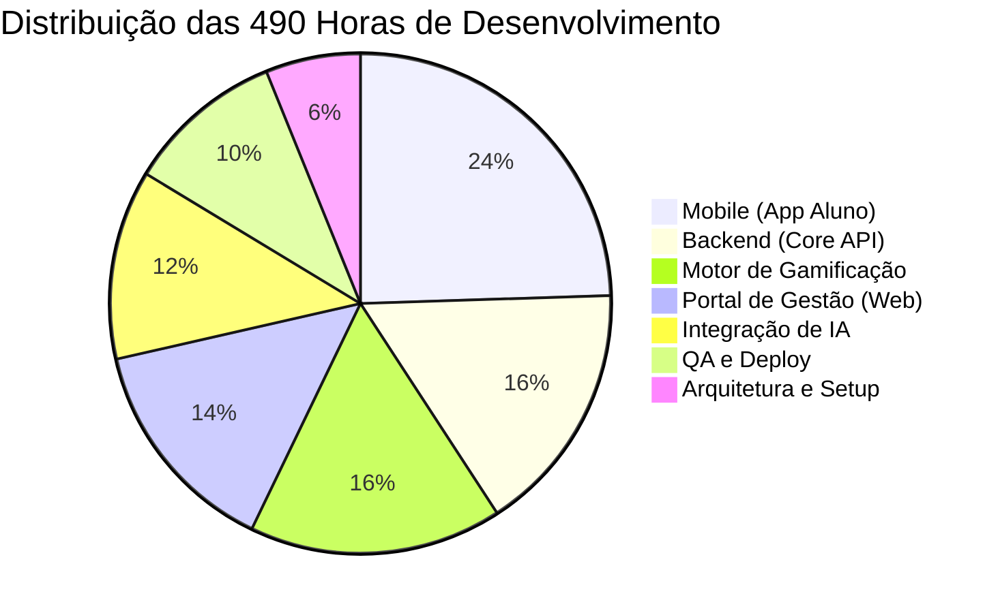

# Unicursos Mobile App


O **Aplicativo Mobile Unicursos** é uma plataforma desenvolvida para complementar a preparação presencial dos alunos em São José dos Campos. Focado em turmas de alta concorrência (como Transpetro, TJ-SP, PMESP e Essencial para Concursos), o app permite a resolução de questões curadas estrategicamente pelos professores, aliando aprendizado à mobilidade e gamificação.

---

## 🧩 Principais Funcionalidades

- **Visão do Aluno:** Resolução de questões offline/online, acompanhamento via dashboard de desempenho, trilhas de concurso e sistema de gamificação (XP, níveis e moedas virtuais).
- **Visão do Professor:** Gestão de conteúdo via portal web, análise de banco de dados (tempo de resolução e taxa de acerto) e disparo de notificações push.
- **Visão Administrativa:** Controle total de usuários, professores, turmas (tags) e cursos.
- **Integração de IA:** Geração automatizada de listas de exercícios baseadas no estilo das bancas, escalando a produção de material didático.

---

## ⏱️ Estimativa de Tempo e Cronograma

O projeto foi dimensionado em módulos lógicos, totalizando **490 horas** de desenvolvimento. 

### Gráfico de Distribuição de Esforço (Horas)



### Detalhamento das Fases

| Fase | Atividade | Carga Horária | Esforço Visual |
| :--- | :--- | :---: | :--- |
| **1. Mobile (App Aluno)** | Frontend em React Native, navegação e telas de resolução. | **120h** | 🟩🟩🟩🟩🟩🟩🟩🟩🟩🟩 |
| **2. Backend (Core API)** | API com FastAPI, autenticação (JWT) e gestão do DB. | **80h** | 🟩🟩🟩🟩🟩🟩🔲🔲🔲 |
| **3. Motor Gamificação** | Cálculo de XP, moedas virtuais e lógica de desbloqueio. | **80h** | 🟩🟩🟩🟩🟩🟩🔲🔲🔲 |
| **4. Portal Web** | Interface administrativa para cadastro e métricas. | **70h** | 🟩🟩🟩🟩🟩🔲🔲🔲🔲 |
| **5. Integração IA** | APIs de IA, prompt engineering e validação de conteúdo. | **60h** | 🟩🟩🟩🟩🔲🔲🔲🔲🔲 |
| **6. QA e Deploy** | Testes de integração e publicação nas lojas (Play/App Store). | **50h** | 🟩🟩🟩🔲🔲🔲🔲🔲🔲 |
| **7. Arquitetura e Setup** | Desenho do BD (PostgreSQL), infraestrutura e nuvem. | **30h** | 🟩🟩🔲🔲🔲🔲🔲🔲🔲 |
| **Total** | | **490h** | |

---

## 🛠️ Stack Tecnológico

- **Frontend Mobile:** React Native
- **Backend API:** Python (FastAPI)
- **Banco de Dados:** PostgreSQL (ou Firebase)
- **Infraestrutura/Notificações:** Nuvem (AWS/GCP) e Firebase Cloud Messaging

---

## 🚀 Como Executar o Projeto (Ambiente de Desenvolvimento)

*(Esta seção será preenchida com os comandos exatos de instalação conforme o código for enviado para o repositório).*

```bash
# Clone o repositório
git clone https://github.com/CordeiroGente/Mobile-Unicursos.git

# Entre na pasta do backend e inicie a API
cd backend
pip install -r requirements.txt
uvicorn main:app --reload

# Em outro terminal, entre na pasta mobile e inicie o App
cd mobile
npm install
npx expo start
```

---
*Desenvolvido sob medida para otimizar o tempo e a aprovação dos concurseiros da Unicursos.* 🚀
