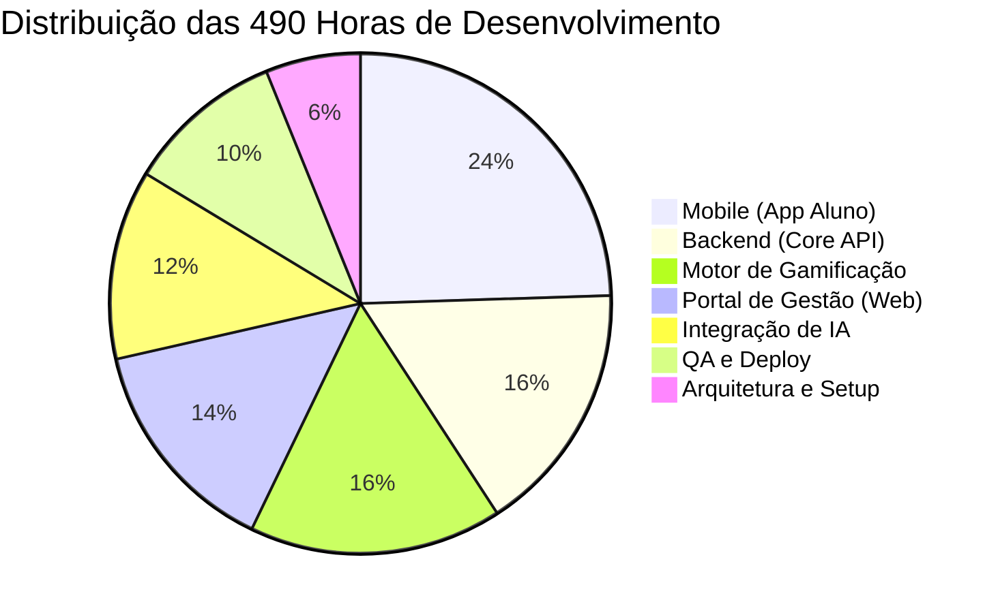

# Unicursos Mobile App


O **Aplicativo Mobile Unicursos** é uma plataforma desenvolvida para complementar a preparação presencial dos alunos em São José dos Campos. O app permite a resolução de questões curadas estrategicamente pelos professores, aliando aprendizado à mobilidade e gamificação.

---

## Principais Funcionalidades

- **Visão do Aluno:** Resolução de questões offline/online, acompanhamento via dashboard de desempenho, trilhas de concurso e sistema de gamificação (XP, níveis e moedas virtuais).
- **Visão do Professor:** Gestão de conteúdo via portal web, análise de banco de dados (tempo de resolução e taxa de acerto) e disparo de notificações push.
- **Visão Administrativa:** Controle total de usuários, professores, turmas (tags) e cursos.
- **Integração de IA:** Geração automatizada de listas de exercícios baseadas no estilo das bancas, escalando a produção de material didático.

---

## Estimativa de Tempo e Cronograma

O projeto foi dimensionado em módulos lógicos, totalizando em estimativa **490 horas** de desenvolvimento. 

### Gráfico de Distribuição de Esforço (Horas)



### Detalhamento das Fases

| Fase | Atividade | Carga Horária |
| :--- | :--- | :---: | :--- |
| **1. Mobile (App Aluno)** | Frontend em React Native, navegação e telas de resolução. | **120h** |
| **2. Backend (Core API)** | API com FastAPI, autenticação (JWT) e gestão do DB. | **80h** | 
| **3. Motor Gamificação** | Cálculo de XP, moedas virtuais e lógica de desbloqueio. | **80h** | 
| **4. Portal Web** | Interface administrativa para cadastro e métricas. | **70h** | 
| **5. Integração IA** | APIs de IA, prompt engineering e validação de conteúdo. | **60h** | 
| **6. QA e Deploy** | Testes de integração e publicação nas lojas (Play/App Store). | **50h** | 
| **7. Arquitetura e Setup** | Desenho do BD (PostgreSQL), infraestrutura e nuvem. | **30h** | 
| **Total** | | **490h** | |

---
## Produto Mínimo Viável (MVP)

Para garantir uma entrega mais rápida e um ambiente de teste mais simples a versão de Produto Mínimo Viável (MVP) foca exclusivamente no "Core" do aplicativo, permitindo que os alunos resolvam questões e acessem os gabaritos.

**Funcionalidades Opcionais Excluídas do MVP:**
*  Integração de IA (Geração automática de questões)
*  Motor de Gamificação (Moedas virtuais, loja e experiência)
*  Portal de Gestão Web (Os cadastros de questões serão feitos diretamente via API ou painel simples na fase inicial)
*  Sistemas de Tags (O aplicativo inicial será uma database sem distinção de atividades)

### Estimativa de Tempo do MVP

Com a redução do escopo, o desenvolvimento do MVP totaliza **280 horas**. Considerando uma jornada padrão, a estimativa de entrega cai para cerca de **7 semanas**.

| Fase MVP | Carga Horária |
| :--- | :--- |
| **Arquitetura e Setup** | 20h |
| **Backend (Core API)** | 60h |
| **Mobile (App Aluno)** | 100h |
| **QA e Deploy** | 40h |
| **Total MVP** | **220 horas (~6 Semanas)** |

---

## Como Executar o Projeto (Ambiente de Desenvolvimento)

*(Esta seção será preenchida com os comandos exatos de instalação conforme o código for enviado para o repositório).*

```bash
# Apenas uma mensagem de teste/Placeholder
```

---
